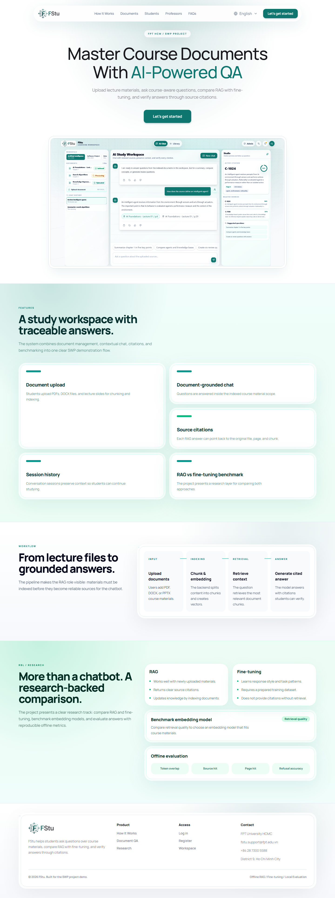
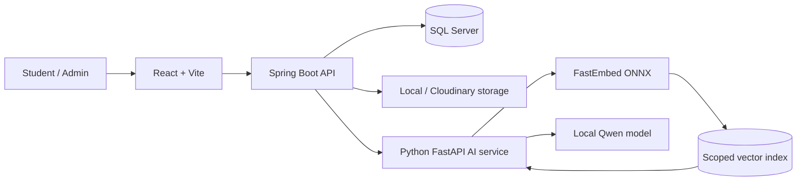
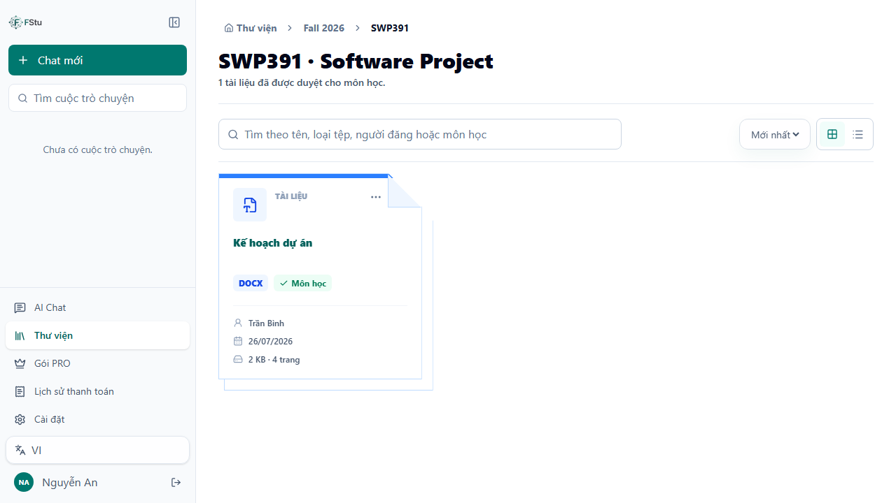
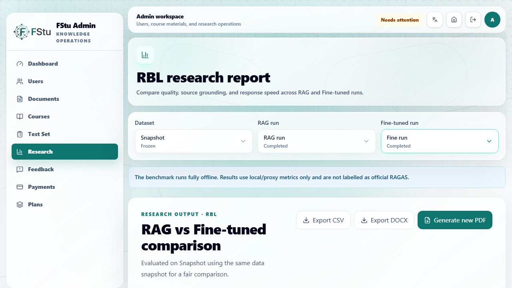

# FStu — Offline AI Learning Assistant


An offline-first learning platform that turns course documents into a scoped,
source-grounded assistant. FStu combines a React client, a Spring Boot domain
backend, a Python AI service, SQL Server, and optional Cloudinary storage.

> Portfolio edition of a team capstone. Secrets, private datasets, model caches,
> generated files, and unverified model artifacts are intentionally excluded.



## Why this project matters

Students often search across unrelated files and receive answers with no clear
source. FStu lets a user select the exact documents to query, retrieves evidence
only from that scope, cites the source, and refuses when the selected material
does not support an answer.

## Engineering highlights

- Document ingestion for PDF, DOCX, PPTX, TXT, and Markdown.
- Resumable uploads with offset validation, retry, and visible progress.
- Protected preview flow for documents that need server-side conversion.
- Cloud asset deletion with a durable retry queue.
- Document-scoped multilingual RAG for Vietnamese, Japanese, and other subjects.
- Offline Qwen generation and FastEmbed multilingual retrieval.
- Separate RAG and Fine-tuned experiment modes using the same frozen dataset checksum.
- Local/proxy research metrics with no silent online judge or hybrid fallback.
- Quality-gated LoRA adapters: failed or unverified adapters cannot enter student chat.
- JWT authentication, role enforcement, revocation, one-time password reset tokens,
  and last-administrator protection.

## Architecture



See [the architecture notes](docs/architecture.md) for upload, RAG, deletion,
and research flows.

## Screens

| Library and document workflow | Offline research dashboard |
| --- | --- |
|  |  |

## Technology

| Layer | Stack |
| --- | --- |
| Client | React, Vite, Tailwind CSS, Vitest, Playwright |
| Domain API | Java 17, Spring Boot, Spring Security, JPA, Maven |
| AI service | Python 3.12, FastAPI, Transformers, PEFT, FastEmbed |
| Data | SQL Server, local vector store, optional Cloudinary |
| Models | Qwen2.5 1.5B Instruct, multilingual MiniLM ONNX, LoRA/QLoRA |
| Quality | JUnit, Pytest, Vitest, Playwright, GitHub Actions |

## Verified quality baseline

- Java: 199 automated tests passing.
- Python: 94 public tests passing; 5 dataset-integrity tests skip when the
  private research corpus is not present.
- Frontend: 86 component/service tests passing.
- Browser E2E: 2 critical responsive workflows passing.
- Production frontend build and lint passing.
- Production npm dependency audit: 0 known vulnerabilities.

The included source supports Fine-tuning, but the previous LoRA artifact is not
published because it failed the behavioral quality gate. This is intentional:
the application remains on grounded RAG until a newly trained adapter passes
answer-quality and refusal benchmarks.

## Run locally

### Prerequisites

- Java 17 and Maven 3.9+
- Node.js 20+
- Python 3.12
- SQL Server 2022
- At least 8 GB RAM for the local base model; NVIDIA CUDA is required for QLoRA training

### 1. Configure

Copy each example file without committing the generated local files:

```powershell
Copy-Item backend-java/.env.example backend-java/.env
Copy-Item ai-service/.env.example ai-service/.env
Copy-Item frontend/.env.example frontend/.env.local
```

Apply the SQL scripts documented in `backend-java/database/APPLY_ALL.sql`, then
provide your own database, JWT, mail, and storage credentials.

### 2. Start the AI service

```powershell
cd ai-service
python -m venv .venv
.\.venv\Scripts\python.exe -m pip install -r requirements.txt
.\.venv\Scripts\python.exe -m uvicorn app.main:app --host 127.0.0.1 --port 8001
```

### 3. Start the Java API

```powershell
cd backend-java
mvn spring-boot:run
```

### 4. Start the frontend

```powershell
cd frontend
npm ci
npm run dev -- --host 127.0.0.1
```

Open `http://127.0.0.1:5173`.

## Test

```powershell
cd ai-service; .\.venv\Scripts\python.exe -m pytest -q
cd backend-java; mvn test
cd frontend; npm run lint; npm test -- --run; npm run build; npm run test:e2e
```

## Security and data policy

No production credential, user database, uploaded document, copyrighted course
corpus, or local model cache belongs in this repository. Read [SECURITY.md](SECURITY.md)
before deploying or reporting a vulnerability.

## My contributions

My primary role in this team project was **Backend Engineer**, responsible for
the backend implementation across the platform:

- Designed and implemented Spring Boot REST APIs and core domain workflows.
- Built authentication and authorization with JWT, role enforcement, token
  revocation, password reset, and last-administrator protection.
- Implemented document upload, resumable transfer, extraction, preview, storage,
  and durable Cloudinary deletion retry flows.
- Integrated the Java API with the local Python AI service for document-scoped
  RAG, Fine-tuned model readiness, and research benchmark orchestration.
- Developed SQL Server schemas, additive migrations, repositories, validation,
  and transactional service logic.
- Added backend security, service, retrieval-scope, upload, payment, and failure-
  recovery tests, contributing to the 199-test Java suite.

## Team project and attribution

This system was built as a collaborative capstone. See [CONTRIBUTORS.md](CONTRIBUTORS.md)
for attribution. The portfolio edition highlights the complete engineering system
without claiming that one contributor authored every component.

## License

Source-available for portfolio review. See [LICENSE](LICENSE).
