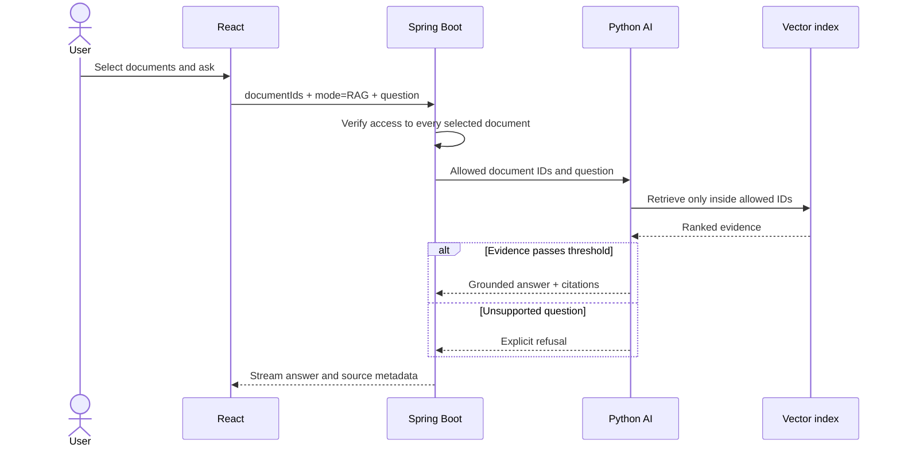

# Architecture and critical flows

## Service boundaries

- `frontend`: presentation, authenticated navigation, upload progress, document
  selection, chat streaming, and research visualization.
- `backend-java`: identity, authorization, course/workspace ownership, document
  lifecycle, billing, evaluation orchestration, and persistence.
- `ai-service`: extraction support, embeddings, scoped retrieval, local generation,
  benchmark metrics, and LoRA lifecycle checks.

## Scoped RAG

## Resumable upload

1. The client creates an upload session with immutable file metadata.
2. Each chunk carries `X-Upload-Offset`; the server rejects gaps and duplicates.
3. Completion verifies final size before creating the document record.
4. Processing extracts, chunks, embeds, and records the exact model version.
5. The UI monitors the durable processing job instead of assuming upload means ready.

## Delete and cloud cleanup

The database lifecycle is completed first. Cloud deletion is then attempted. A
temporary provider failure creates a durable cleanup job with exponential backoff;
`not found` is treated as an idempotent success.

## Fine-tuned safety boundary

Fine-tuned mode never receives retrieval context. It is available only when the
selected sources match the training manifest, checksums match, the adapter passes
the behavioral gate, and the local inference runtime has loaded it successfully.

## Research integrity

RAG and Fine-tuned runs must share the same frozen dataset checksum and benchmark
profile. The default evaluator is fully offline and labels its values as local or
proxy metrics, never as Official RAGAS.
